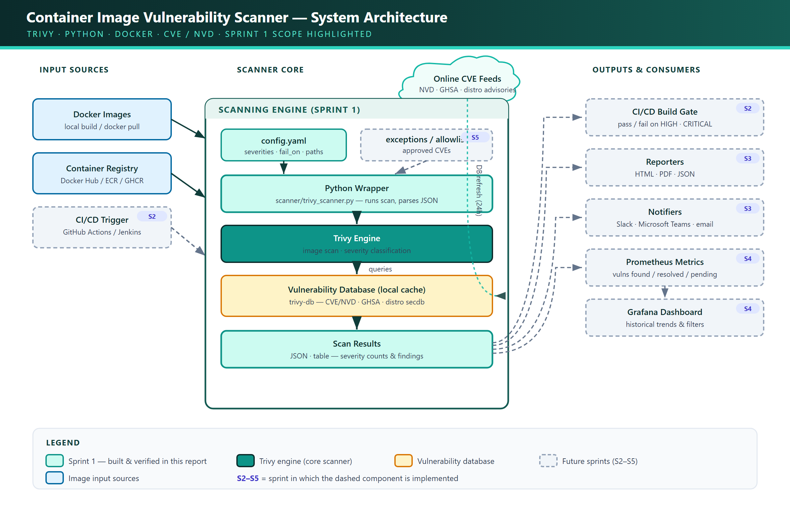

# CapstoneProject
Project Title: Container Image Vulnerability Scanner with Reporting

## Architecture Overview

The diagram below shows the complete system we designed for this project. We planned the
full architecture up front and are building it incrementally across six sprints. In the diagram,
the components highlighted in teal are the ones we have already built and verified in **Sprint 1**
(the scanning engine), while the dashed boxes are the parts our team will add in the later sprints
(tagged `S2`–`S5`).

We laid the system out as a left-to-right pipeline so it is easy to follow how an image travels
from input, through scanning, to the final outputs. It is organised into three parts.

### 1. Input Sources (left)

This is where a container image comes from before we scan it:

- **Docker Images** — images we build locally or pull with `docker pull`.
- **Container Registry** — images stored in Docker Hub, Amazon ECR, or GHCR.
- **CI/CD Trigger** *(Sprint 2)* — later, a pipeline (GitHub Actions / Jenkins) will hand an image
  to the scanner automatically on every code push.

### 2. Scanner Core (center) — what we built in Sprint 1

This is the heart of the project and the work we completed in Sprint 1. The flow inside it is:

1. **`config.yaml`** — our central configuration. We keep all settings here (which severities to
   report, the `fail_on` threshold, output paths) so nothing is hard-coded.
2. **Python Wrapper** (`scanner/trivy_scanner.py`) — the wrapper we wrote that reads the config,
   runs the scan, and parses the results into a clean format.
3. **Trivy Engine** — the scanner that actually inspects the image and classifies findings by
   severity.
4. **Vulnerability Database (local cache)** — Trivy's local copy of known vulnerabilities
   (**CVE/NVD**, GitHub advisories, and distro security data). It refreshes from the online
   **CVE feeds** roughly every 24 hours, which is what keeps our checks up to date.
5. **Scan Results** — the structured output we produce (JSON + table) with per-severity counts and
   the list of findings.

### 3. Outputs & Consumers (right) — planned for later sprints

These are the parts we will connect the scan results to in the upcoming sprints:

- **CI/CD Build Gate** *(Sprint 2)* — pass or fail a build when HIGH/CRITICAL issues are found.
- **Reporters** *(Sprint 3)* — generate HTML, PDF, and JSON reports.
- **Notifiers** *(Sprint 3)* — send alerts to Slack, Microsoft Teams, or email.
- **Prometheus + Grafana** *(Sprint 4)* — collect metrics and show historical trends on a dashboard.
- **Exceptions / Allowlist** *(Sprint 5)* — let us approve known CVEs so they are filtered out of
  the reports.

### Why we designed it this way

- **Separation of concerns** — we kept the Python wrapper as a thin layer over Trivy, so the core
  does one job well and we can add reporting, notifications, and CI/CD later without rewriting it.
- **Config-driven** — because thresholds and paths live in `config.yaml`, we can change the
  scanner's behaviour without touching the code. The `fail_on` value is what we will use to break a
  CI build in Sprint 2.
- **Runs locally and for free** — everything runs on Docker Desktop and Python, so our running cost
  stays at zero (the only network use is the one-time database and image downloads).
- **Standards-based** — every finding maps back to an official **CVE/NVD** identifier with a CVSS
  score, so our severities follow the industry standard rather than anything we invented.

